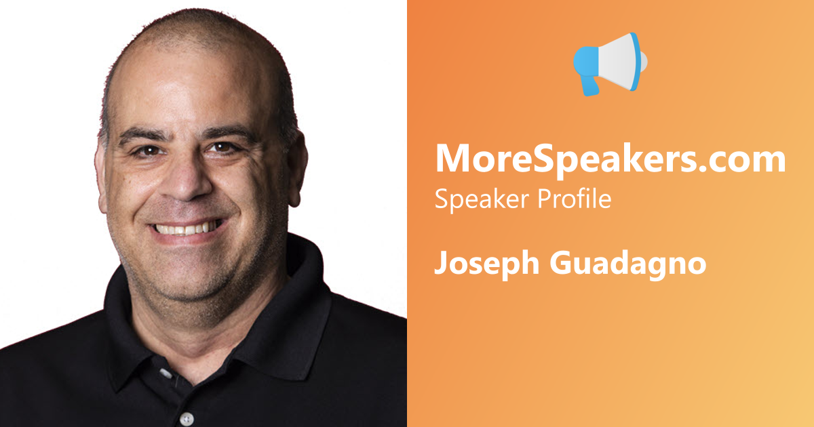

# OpenGraph Profile Image Generator Sample Application

This sample application generates Open Graph profile images based on the Open Graph Protocol.  The `OpenGraphProfileImageGenerate.Manager` contains several methods that can be used to generate Open Graph profile images.  Essentially, it will generate a 1200x630 image for the `og:image` tag.  This sample is geared towards the needs for the [MoreSpeakers.com](https://morespeakers.com) site.  If you look at the `OpenGraphProfileImageGenerate.Manager` class, you will see a method with the following signature:

```csharp
public Image GenerateSpeakerProfile(Image speakerImage, Image logoImage, string speakerName,
        FontFamily fontFamily,
        int width = 1200, int height = 630)
```

This method contains all the logic for generating the Open Graph profile image. Here is a sample of the output with the following parameters:

```csharp
var testImage1A = await speakerProfileGenerator.GenerateSpeakerProfileFromUrlsAsync(
    "https://www.josephguadagno.net/assets/images/authors/Joe_Guadagno_512x512.jpg",
    "https://morespeakers.com/images/favicons/android-icon-192x192.png",
    "Joseph Guadagno", speakerProfileGenerator.ThemeFonts);
if (testImage1A != null)
{
    await testImage1A.SaveAsPngAsync(Path.Combine(outputFolder, "test-speaker1a-profile.png"));
```

***NOTE***: This assumes you have one of the fonts in the `OpenGraphProfileImageGenerate.Manager.ThemeFonts` collection.


~~~~
## References

Open Graph Protocol [ogp.me](https://ogp.me/)

## Image Processing

Image processing is done using the SixLabors [ImageSharp](https://docs.sixlabors.com/articles/imagesharp/index.html) library and SixLabors [Fonts](https://docs.sixlabors.com/articles/fonts/index.html) library

## Font

The test font for this sample is [Ubuntu](https://fonts.google.com/specimen/Ubuntu), the [Ubuntu Font License](https://fonts.google.com/specimen/Ubuntu).
